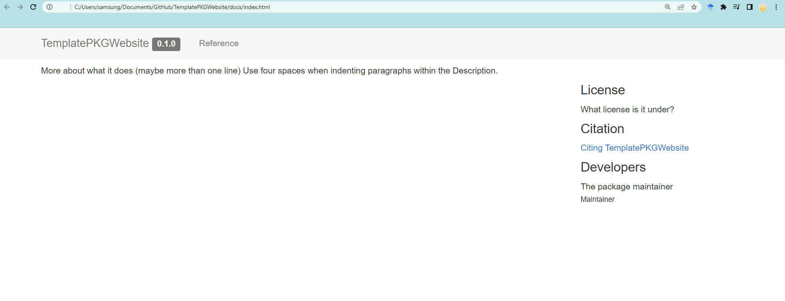

```{r, include = FALSE}
knitr::opts_chunk$set(
  collapse = TRUE,
  comment = "#>"
)
```


# Introduction

In this post, I try to outline the steps needed to create a website for your R package using the pkgdown package. In particular, I will show you how to get Travis-ci to automatically build the website and deploy it to your gh-pages branch on GitHub.


This tutorial assumes you have basic knowledge of Git commands pull, push, commit, and what a branch is. It also assumes working knowledge of R, and what continuous integration is. You must also have a GitHub account and have a GitHub Pages user site.

Note: the steps outlined below are a recollection of what I remember from recently doing the samething for our casebase R package. You can probably figure out most of this out using the documentation from the usethis, pkgdown and travis R packages. However, I found that certain pieces of information were missing or I had to search beyond these docs to make everything work. Please feel free to comment below if this tutorial doesn’t work for you.

## Pre-requisites

* A GitHub account
* A Travis-ci account linked to your GitHub account
* The following R packages:

```{r, eval=F}
install.packages(c("devtools","usethis","knitr","rmarkdown", "roxygen2", "pkgdown"))
# devtools::install_github("ropenscilabs/travis")
```


## References

* <https://sahirbhatnagar.com/blog/2020/03/03/creating-a-website-for-your-r-package/>


# Step by Step Guide

## Step 1: Create an R package

    * In your local Rstudio, create a local R pacakge (a very simple one) with a package name whichever you want. I created a package called `TemplatePKGWebsite`. My package is located in `Documents/Github/TemplatePKGWebsite`. You can do this with two following ways:
      - Use R code to create R package
```{r,eval=F}
# setup R package structure
usethis::create_package("TemplatePKGWebsite")
```
      - Go into Rstudio > File > New Project > New Directory > R package
        .

## Step 2: Initialize Git Repository

Let's initialize the project as a git repo, commit your changes, set the remote and push to the remote. There are many ways to accomplish this which I explain in my tutorial. Here I will use the command line to accomplish this:

  * Create a repository in Github. I named the repo as `TemplatePKGWebsite`
    

  * Push the R package folder to my remote repository.

```console
cd Documents/Github/TemplatePKGWebsite
git status
git add --all
git commit -m "initial version of the R package"
git branch -M main
git remote add origin https://github.com/username/TemplatePKGWebsite.git
git push origin main
```

## Step 3: Initialize website using pkgdown

With the below line of code, it will automatically pop-up a website for the package `TemplatePKGWebsite`. This will create `/docs` folder in the root of your package directory which contains all the source files for your website.
```{r, eval=F}
# Run to build the website
pkgdown::build_site()
```
  .

## Step 4: setup R package structure

First, setup R package structure such ad `README.md`, `LICENSE.md`, `NEWS.md`, and vignette files.
```{r, eval=F}
# Run once to configure package to use pkgdown
usethis::use_pkgdown()

# created README.md for Github landing page
usethis::use_readme_md(open = FALSE)

# creates LICENSE.md file
usethis::use_mit_license("Jenny Lee")

# creates NEWS.md file
usethis::use_news_md(open = FALSE)

# create a vignettes folder and vignettes/first_vignette.Rmd
usethis::use_vignette("first_vignette")

# create a vignettes/how_to_build_pkgdown_website.Rmd
usethis::use_vignette("how_to_build_pkgdown_website")
```

Note that the title of the vignette should be the same as what goes into `\VignetteIndexEntry{}`.
```console
title: "Creating a website for your R package: using pkgdown"
output: rmarkdown::html_vignette
vignette: >
  %\VignetteIndexEntry{Creating a website for your R package: using pkgdown}
  %\VignetteEngine{knitr::rmarkdown}
  %\VignetteEncoding{UTF-8}
```
Then, create a `.gitignore` file in the root of the directory with the following two lines:
```console
TemplatePKGWebsite.Rproj
.Rproj*
```
Let's check how the website looks like now. Note that now `article` and `changelog` tab has been added.
```{r, eval=F}
# This will automatically open up your web browser with the built website
pkgdown::build_site()
```
  


## Step 5: Host the website using GitHub Pages

Next we need to publish the website online, easy way using the `/docs` folder. Note that this is not an automatic way which requires you to build the website locally everytime you make a change to the documentation or vignettes, and then push to github. 

Commit the changes (the newly created `/docs` folder) and push them to the remote (on the master branch):
```console
git add --all
git commit -m "Customzie website and add vignettes"
git push origin main
```

Then head over to the Settings on your GitHub repo and scroll to the GitHub Pages section and select master branch `/docs` folder in the dropdown menu:

.

Your website is on live now on this address: `https://username.github.io/TemplatePKGWebsite/`.

## Step 6: Update your website

Simply re-build locally using `pkgdown::build_site()` and then push to GitHub. GitHub Pages will then always use the files in the `/docs` folder for the source code of your website.

## Step 7: Let `roxygen2::roxygenise()` converts roxygen comments to `.Rd` files

There are three steps in the transformation from `roxygen` comments in your source file to human readable documentation:

* You add `roxygen` comments to your source file.
* `roxygen2::roxygenise()` converts roxygen comments to `.Rd` files.
* R converts `.Rd` files to human readable documentation.

```{r, eval=F}
roxygen2::roxygenise()
```

# References

* [pkgdown website](https://pkgdown.r-lib.org/reference/build_site.html).
* [Xie, Y., Hill, A.P. and Thomas, A., 2017. Blogdown: creating websites with R markdown. CRC Press.](https://bookdown.org/yihui/blogdown/).
* [Xie, Yihui, Joseph J. Allaire, and Garrett Grolemund. R markdown: The definitive guide. CRC Press, 2018.](https://bookdown.org/yihui/rmarkdown/).
* [roxygen](https://cran.r-project.org/web/packages/roxygen2/vignettes/roxygen2.html).
